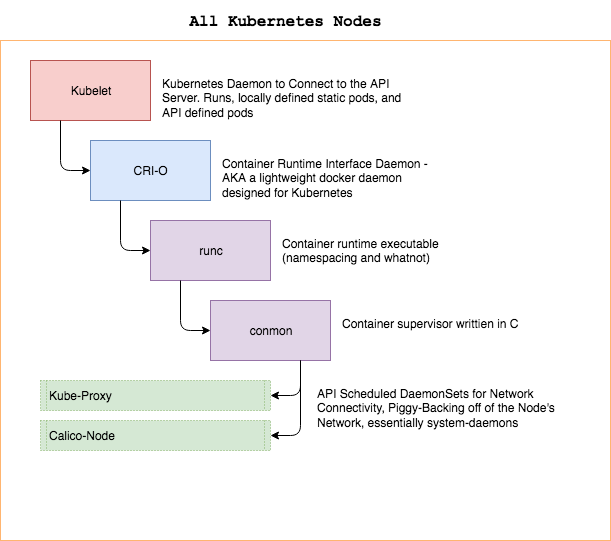
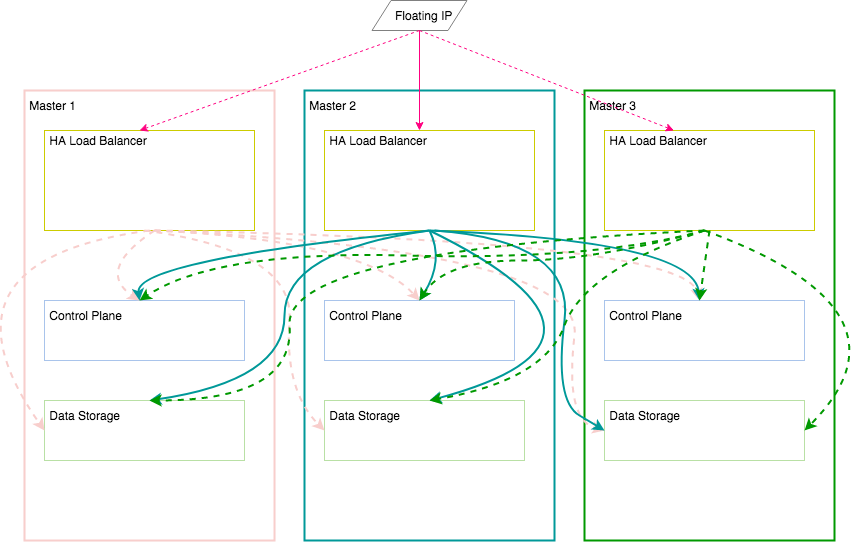
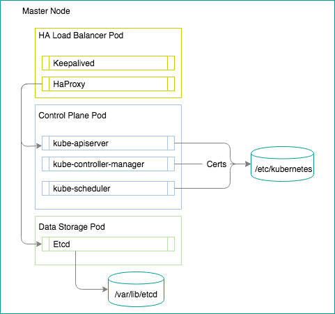

# Architecture

A general overview of what to do with this project.

## Nodes

What you need to bring.

A sample copy of a kube-proxy daemonset can be found [here](kubeconfigs/kube-proxy.yml)

## Data Flow

How it's wired together.

## Master Nodes

How a master node is run. Everything is a static pod defined in a yaml file.
There is an example template Here: [KubeConfigs](kubeconfigs/manifest.yml)

